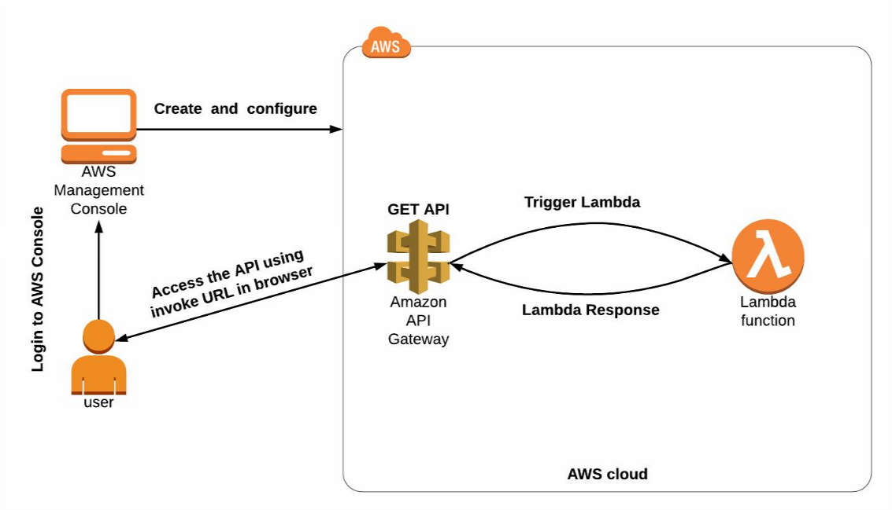
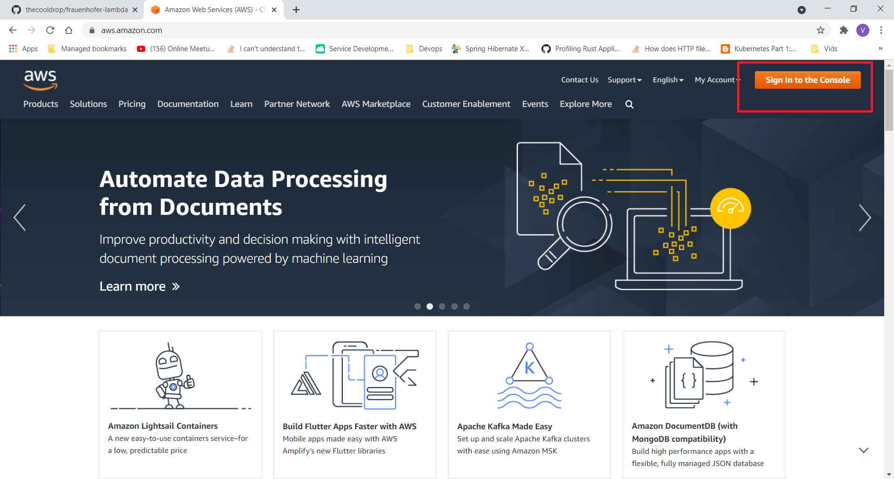
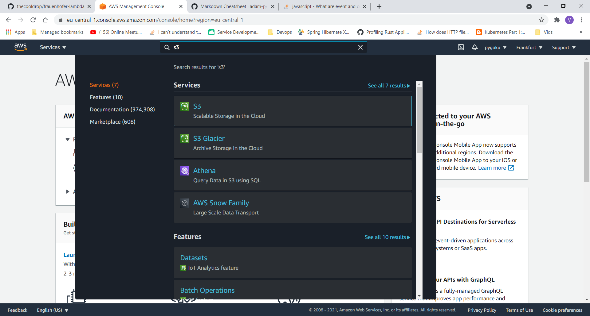
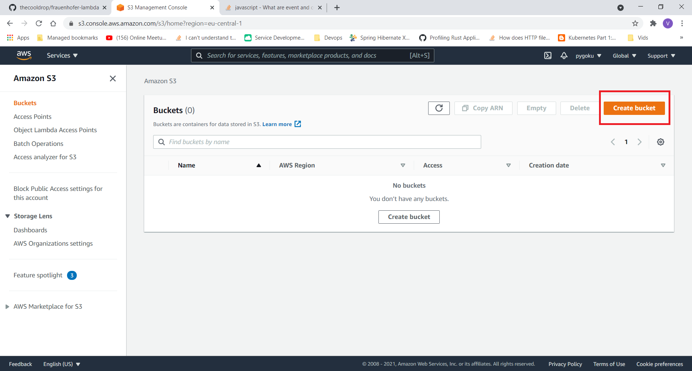
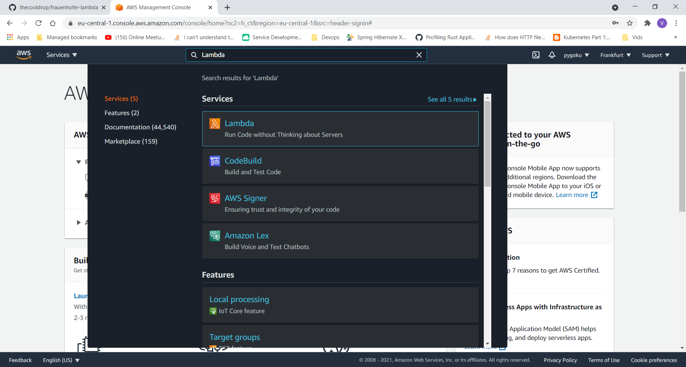
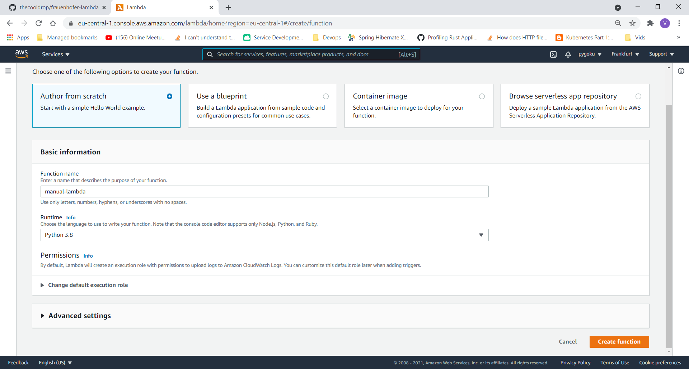
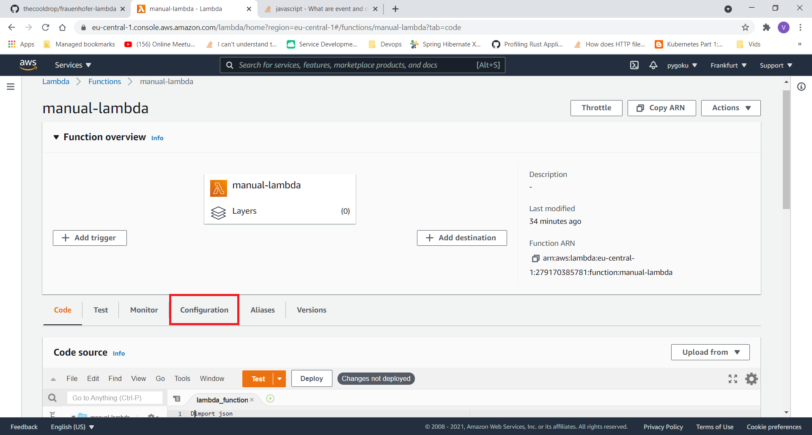
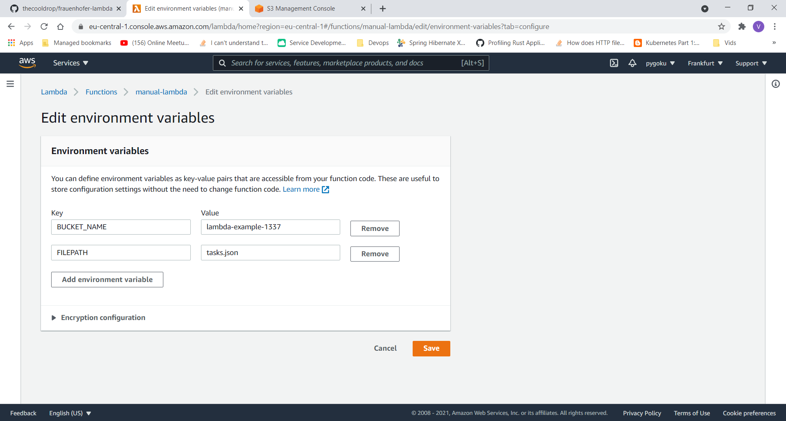
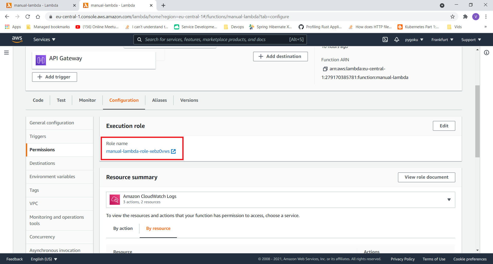
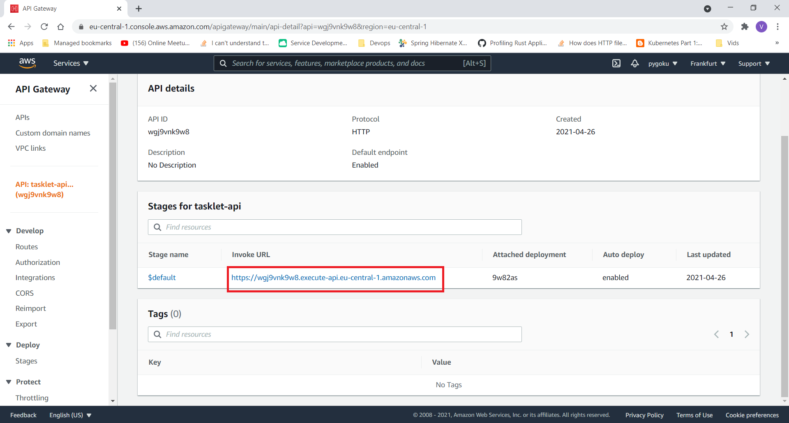

# Lambda as gateway to AWS

In this lab we are going to demonstrate how AWS can be easily used to deploy 
small services and to make them available to public. The focus point of this
lab is to show simple AWS services, and how they make deployment and development
of applications easier.

In this example we are going to be developing a backend for simple TODO list 
application using Python and AWS. The application is going to persist a TODO 
list and will enable retrieval of the task list from our service. 

First we are going to go through configuration of AWS resources, which are 
necessary for deploying the application. Next we are going to deploy the 
code and test it, and lastly we are going to show the weaknesses of 
click-and-configure methodology and how this can be replaced with
infrastructure-as-code approach. So let's get kickin!

## Infrastructure of TODO application

The TODO list application will need to store the list of tasks somewhere so
that we can retrieve it later. Compute resources are going to be necessary
to exeucte the code. Lastly we will need to configure access to our application
so that it can be consumed by us or our users.

### Infrastructure overview

For deployment of our application we are going to be using AWS Lambda, S3 bucket
and AWS API Gateway services.

The AWS Lambda service is going to  provide the compute resources on which
our application is going to be running. This is a so-called serverless runtime,
which means we only need to specify the code, which we would like to have executed
and AWS takes care of the rest.

For persisting of our task list we are going to be utilizing simple file-based
storage solution, which is going to be provided to us by S3 service. S3 is
simple storage service for storing so called objects into so called buckets,
which are analogous to files and file-systems, but with important differences
regarding availability, replication and redundancy.

Last service on our hit-list is the AWS API Gateway service. API Gateway service
is a service for managing APIs to our service, whose functionality is provided
by Lambda function. We are going to use it to specify how our users may interact
with the service. Word of caution on terminology here: API is nothing more than
a specification of how users can interact with our service.



As we can see in the image above our users are going to be able to communicate with
our service via an API provided by the API Gateway. An example of interacting
with our application via Gateway is as follows:

- User makes a request according to specification provided by our API
- The request is received by API gateway
- API gateway converts the user request into format suitable for processing in 
  Lambda function and forwards it to the Lambda function
- Lambda function processes the request obtained from API gateway and responds
  in format suitable for API gateway
- API gateway converts the Lambda response to the format suitable for end-user and
  returns it back to the user
  
## Configuring the infrastructure

In this part of the lab we are going to proceed with configuring the necessary 
infrastructure by hand in AWS console. The first we will need to do is to
log in our AWS account.




### Configuring the S3 bucket

In the AWS console search for S3 service and proceed to create a new S3 bucket:




Proceed to choose a name for your bucket and click on `Create bucket` button at
the bottom of the dialog. Leave all other configurations on default. 

Configure your S3 bucket by following the steps:
- Click on your bucket in the list of S3 buckets
- Click on the upload button 
- Drag and drop the `tasks.json` file from this repository into the area
  designated for drag and drop uploads
  
Now you have created a file which is going to store your task list in your
S3 bucket.

### Configuring the Lambda function

In the first step we are going to create an empty Lambda function. Once logged in
proceed to search for `Lambda` in the search bar in the upper middle part of the
console.



We are going to call our Lambda function `manual-lambda` and we are going to choose
`Python 3.8` as our runtime from the list of available runtimes. Now we create
our empty Lambda function by clicking on the `Create function` button in the
lower right corner.



Now we have an empty Lambda function implementing simple `Hello world!` program.
Here we can see that Lambda function is really just that, namely a function 
which has two parameters named event and context. To learn more about these 
parameters you may consult this
[Stackoverflow explanation of these parameters][SO Event and Context].

In order to have a functioning TODO list we are going to need somewhere to store
our list of tasks. Previously we have created an S3 bucket and a file
into which we are going to save our task list. For Lambda function
to be able to read the file and write to it, we need to configure our Lambda
function to read from the desired S3 bucket and file.

Environment variables are often used for passing the configuration parameters
to software deployments, so that is what we are going to use here. These variables
are then going to be accessible within our Lambda function. 

Click on the `Configuration` button in the overview of your Lambda function and then
click on `Environment variables` button in the left-hand side menu.



Configure two random variables :

- First random variable should be called `BUCKET_NAME` with value equal to the,
  name of the bucket of the bucket which you have previously created. As the 
  name of the environment variable suggest, this contains the name of the
  bucket which is going to be used by Lambda function for persistence.
- Second random variable should be called `FILEPATH` with value equal to
  `tasks.json`. This random variable contains the path to file in which
  we are going to persist are task list. Path to the file is a relative 
  path, where path is relative to the bucket.
  

In the end your configuration should look something like this:



Now comes the most vital part of a Lambda function, namely the code. Go back to
the overview of your Lambda function and in the code editor paste in the 
content of `app.py` file, which you can find in this repository. Do not forget
to click on the `Deploy` button above the code editor to deploy your code.

Now may be the good time to analyze what our code is actually doing. Try to
answer following questions for yourself:

- Where are the enviroment variables getting used in the code?
- Where do we read out the concent of `tasks.json` ?
- Where do we write to `tasks.json` ?
- What is that `boto3` thing we keep using?

You should have a fully configured Lambda function, which is ready to be
presented to the world. Let's start working on that presentation in the next
part.

### Permissions configuration

Important thing to know in AWS is that by default almost none of the services
which you provision in your account are accessible by other services which 
you provision. This means that access to resources is tightly controlled,
which is usually what we want in order to maximize security.

A consequence of this behavior is that per default our Lambda function
can not access the files in our buckets, because it does not have the
rights. The access rights can be managed on very fine level, or on
very coarse level. For example we could say that our Lambda function
is allowed to execute specific actions on specific file in specific 
bucket, but for our purposes such controll may be an overkill.

To keep things simple we will allow our Lambda function to do 
anything it wants with any of S3 resources. We assign permissions to Lambda
function by assigning rights to the role, which is assumed by the Lambda function
when it starts executing.

First we find out the role, which gets assumed by Lambda function during the
execution:
- Go to your Lambda function
- Go to `Configuration` tab
- In the left-hand menu click on `Permissions`
- Note for yourself the role which gets assumed by Lambda function for execution



In the search bar enter `IAM` and navigate to the first service in the list of 
services. To configure the rights for Lambda function:
- Click on `Roles` in the left-hand side menu
- In the search bar in middle of your screen enter the name of the role assumed
  by your Lambda function. Click on the role found
- Click on the role and then click on `Attch policies` button
- In the search bar search for `AmazonS3FullAccess` and select the policy
- Click on `Attach policy` button in lower right corner of the screen

You have now allowed any service which assumes this role to do anything it wants
with any of the objects belonging to the S3 service. This of course includes
the Lambda function you have previously created.


### Configuring the API gateway

In the console search bar enter `API gateway` and navigate to the first service
from the list of search results. You should now be seeing the console of
`API Gateway` service. 

In the console click on `build` button for `HTTP API` to start configuring
the access to Lambda function and then:

- Click on `Add integration` and choose `Lambda` from the dropdown menu to
  indicate that API is going to be targeting a Lambda function. Proceed
  to select your Lambda function, which you have created in previous step.
- Choose a suitable name for your API and click on `Next`
- In the next step, click on `Add route` button to add one more route in
  addition to the default configured route. For the first route choose
  `Method` to be `GET` and for second route choose method to be `POST`.
  Field `Resource path` of both routes should be `/tasks` and both should have
  our previously created Lambda function as entry in `Integration target` field.
- Proceed to click on `Next` and `Create` buttons to finish configuring the
  API gateway.
- Copy the URL assigned to this API gateway



### Test your application 

Now we need to confirm that the thing we have built also works. We are going to be using
Postman to execute HTTP requests against our service. [Download Postman][Download Postman]
and import the collection of requests which you can find in this repository in file
`postman_collection.json`.

You can now choose one of the requests and replace the target URL, so that
your requests get sent to `<your url>/tasks`.


## Recap

In the sections above we have manually configured the infrastructure necessary
for provisioning a small backend application for persisting and accessing a
list of tasks. We have:

- Configured the persistence solution
- Provisioned the compute resources where our application is going to run
- Configured our Lambda function with environment variables
- Configured the access rights, so that Lambda can access our configured
  persistence solution
- Configured an API to make our application accessible to public

The list of things we have done is pretty long, and giving a detailed
description of all the resources we have provisioned would be pretty hard.
Further besides the lack of overview of provisioned resources lot of manual
work would be necessary to delete all of these resources in order to stop
incurring further usage costs, once these resources are not necessary.

Configuring infrastructure by clicking around in console is lacking in nature.
Beside lacking in overview, this method of configuring your resources is 
error prone, and once you make a change which breaks something you have no
way of restoring the previous functional state.

## Enter infrastructure-as-code

The problems described above can all be solved by leveraging a methodology
known as infrastructure-as-code.

According to [Wikipedia definition][IaC definition wikipedia] infrastructure as code (IaC) is:

```text
Infrastructure as code (IaC) is the process of managing and provisioning computer
data centers through machine-readable definition files, rather than physical hardware configuration
or interactive configuration tools.
```

In reality IaC is even more general than implied by the definition above, and usually includes
provisioning and description of services and compute resources necessary to deliver and deploy
software in large-scale heterogeneous computational environments.

IaC can be realized using different tools, but most popular one is Terraform. This tool
integrates with large number of technologies and cloud-providers to enable declarative
descriptions of applications, services and infrastructure deployed. 

To finish this lab in glamorous style we are going to dive into Terraform and migrate
our deployed example once more as code.

## Terraforming manual labor 🚀

### Prerequisites

For this piece of the lab you are going to require following software installed on
computer:

- [Terraform][Terraform installation]
- [AWS CLI][AWS CLI installation]

Enable access to your AWS account via CLI:

- Log into AWS console
- Navigate to `IAM` service via search bar
- In the left-hand side menu click on `Users`
- Click on your username in the middle of the screen
- Click on `Security Credentials` 
- Scroll down and click on `Create access key`
- **Click on `Create access key` and save it as `.csv` as you will only be
  able to access it once**
- Open the command line terminal (either `Powershell` for `Windows` or `Terminal` for `Linux`)
- Enter following commands into your terminal:

```powershell
> aws configure
AWS Access Key ID [None]: <your access id from CSV file>
AWS Secret Access Key [None]: <your secret access key from CSV file>
Default region name [None]: eu-central-1
Default output format [None]: yaml
```

### Configure your infrastructure as code

Now comes the magic. In order for magic to work please follow the further
instruction which you are going to find in the `main.tf` file in this repository.


[SO Event and Context]: https://stackoverflow.com/questions/53936773/what-are-event-and-context-in-function-call-in-aws-lambda#:~:text=When%20Lambda%20runs%20your%20function,input%20to%20a%20regular%20function.
[Download Postman]: https://www.postman.com/downloads/
[IaC definition wikipedia]: https://en.wikipedia.org/wiki/Infrastructure_as_code
[Terraform installation]: https://learn.hashicorp.com/tutorials/terraform/install-cli
[AWS CLI installation]: https://aws.amazon.com/cli/